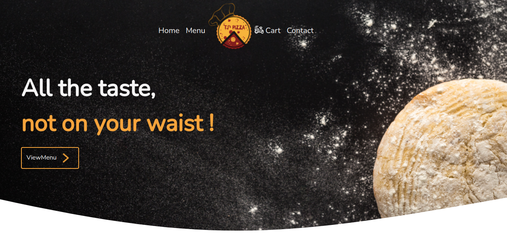
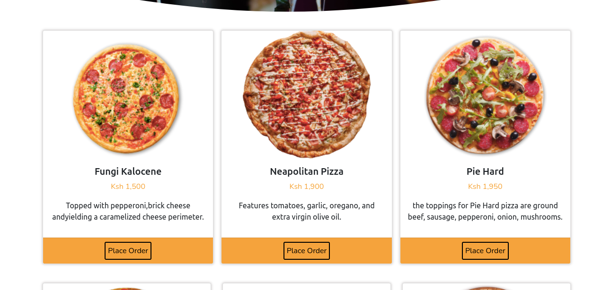
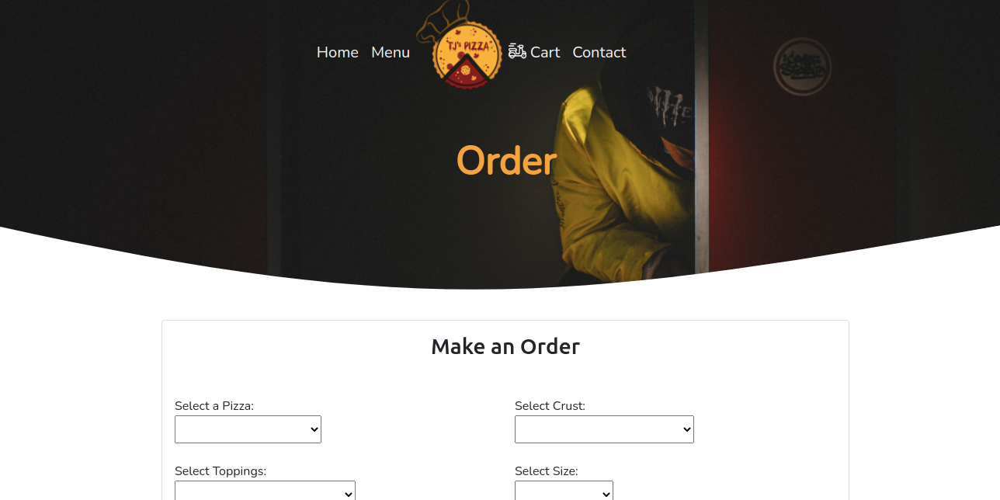
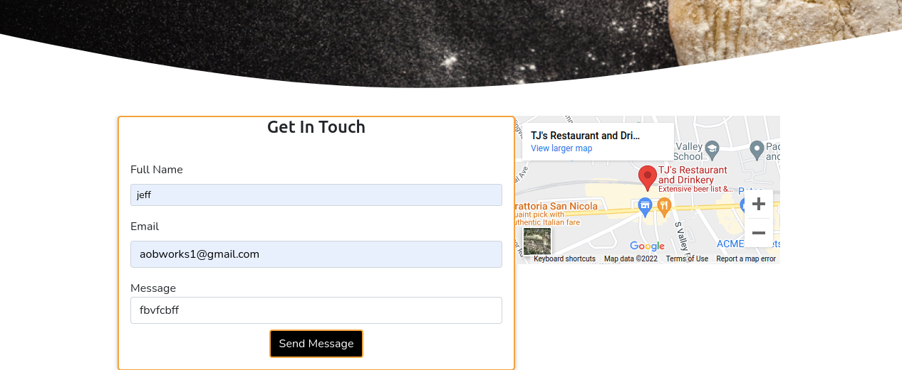

# TJ's Pizza
#### 23/03/2022
This is a basic html/css website that displays infomation about a Pizza restaurant
#### By 
Geoffrey Gichaga .G

## Table of Content

+ [Description](#description)
+ [Installation Requirement](#Installation)
+ [Known Bugs](#Known-Bugs)
+ [Technology Used](#technology-used)
+ [Support and Contact Details](#Support-and-contact-details)
+ [Authors Info](#author-Info)

## Description
This is a school Project where we were tasked to come up with a Pizza restaurant site.
It basicaly  provides users with information about the different pizzas that are sold and allow them to order and have pizzas delivered to their preffered destinations.
The site has the the following view on a desktop mode display:
### LandingPage

### Menu

### Cart

### Contact

 

## Setup/Installation Requirements
* SIte can be accessed through the repo live link
* A phone .tablet or a desktop computer

## Known Bugs
There are no known bugs ,if you spot one please dont hesitate to inform me.
## Technologies Used
Languages used in developing this site include:
* HTML 
* CSS
* Bootstrap
* Javascript
## Support and contact details
You can report any issue you encounter with the site on [Email](geoffrey.githinji@student.moringaschool.com)

### Copyright (c) {year}
copyright (c) 2022.All rights reserved.

## Authors Info
LinkedIn - [Geoffrey Gichaga .G](https://www.linkedin.com/in/geoffrey-gichaga-234318ba/)

